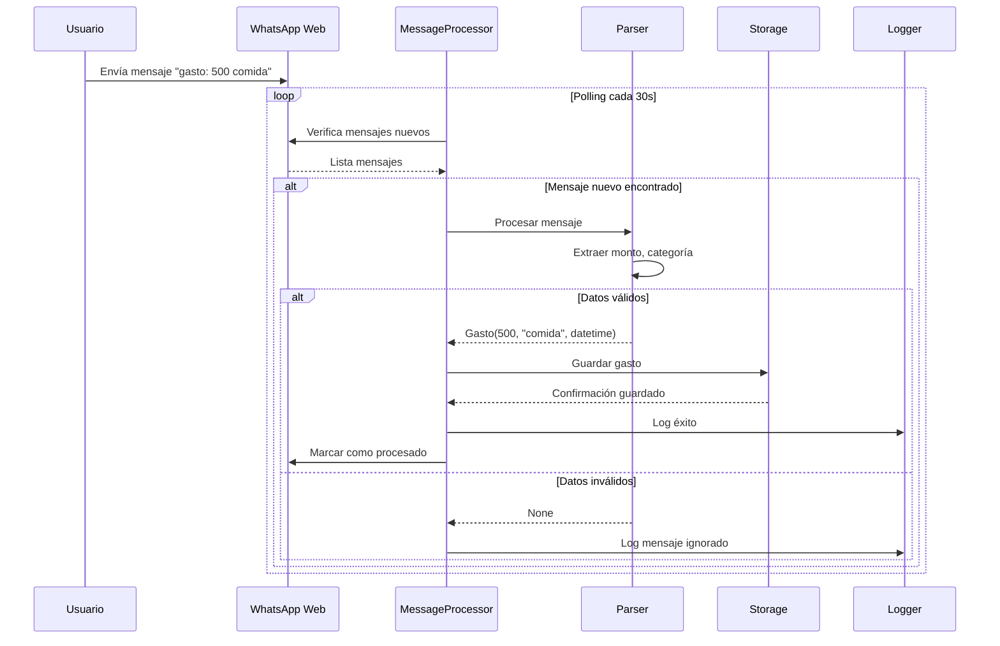
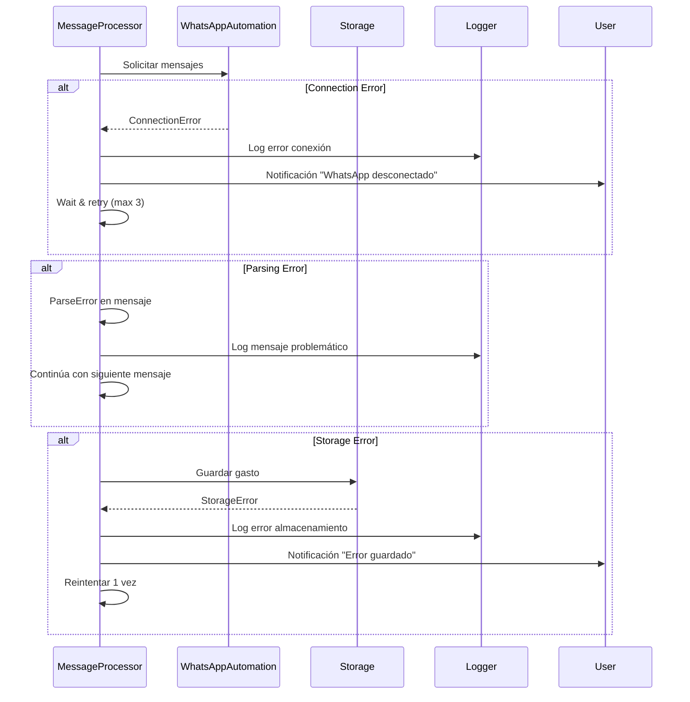

# Bot Gastos WhatsApp - Architecture Document

## Introduction

Este documento define la arquitectura completa para el Bot Personal de Registro de Gastos desde WhatsApp Web. El sistema automatiza la lectura de mensajes de WhatsApp y registra gastos en almacenamiento local usando Python 3 con arquitectura en capas.

### Document Scope

Arquitectura para sistema standalone de automatización web con almacenamiento local dual (Excel/SQLite) y procesamiento de mensajes en tiempo real.

### Change Log

| Date       | Version | Description          | Author  |
| ---------- | ------- | -------------------- | ------- |
| 2025-08-06 | 1.0     | Initial architecture | Winston |

## High Level Architecture

### Technical Summary

Sistema Python standalone que automatiza el registro de gastos mediante lectura automatizada de WhatsApp Web usando Selenium. Implementa arquitectura en capas (domain, application, infrastructure, interface) con almacenamiento local dual y procesamiento de mensajes con reconocimiento de patrones.

### Tech Stack

| Category        | Technology   | Version | Purpose                        |
| --------------- | ------------ | ------- | ------------------------------ |
| Runtime         | Python       | 3.9+    | Lenguaje principal             |
| Web Automation  | Selenium     | 4.15.0+ | Automatización WhatsApp Web    |
| Browser         | ChromeDriver | Latest  | Driver para Selenium           |
| Excel Storage   | openpyxl     | 3.1.0+  | Manejo archivos Excel          |
| Database        | sqlite3      | Built-in| Base datos alternativa         |
| Date/Time       | datetime     | Built-in| Manejo fechas                  |
| Testing         | pytest       | 7.0.0+  | Framework testing              |
| Logging         | logging      | Built-in| Sistema logging                |

### Architectural Patterns

- **Clean Architecture:** Separación domain/application/infrastructure/interface
- **Repository Pattern:** Abstracción acceso datos (Excel/SQLite)
- **Strategy Pattern:** Intercambio entre Selenium y alternativas
- **Observer Pattern:** Detección eventos nuevos mensajes
- **Command Pattern:** Procesamiento comandos de gastos

## Data Models

### Core Entities

#### Gasto Entity

```python
@dataclass
class Gasto:
    monto: Decimal
    categoria: str
    fecha: datetime
    descripcion: Optional[str] = None
    
    def __post_init__(self):
        if self.monto <= 0:
            raise ValueError("El monto debe ser positivo")
        if not self.categoria:
            raise ValueError("La categoría es requerida")
```

#### Mensaje Entity

```python
@dataclass
class Mensaje:
    texto: str
    fecha: datetime
    remitente: str
    
    def es_gasto(self) -> bool:
        """Determina si el mensaje contiene información de gasto"""
        return any(keyword in self.texto.lower() 
                  for keyword in ['gasto', 'gasté', 'pagué', 'compré'])
```

## API Specification

### Internal API - Message Processing

```python
class MessageProcessor:
    def procesar_mensaje(self, mensaje: str) -> Optional[Gasto]:
        """
        Procesa un mensaje y extrae información de gasto
        
        Args:
            mensaje: Texto del mensaje de WhatsApp
            
        Returns:
            Gasto object si se puede extraer información, None si no
            
        Examples:
            "gasto: 500 comida" -> Gasto(500, "comida", datetime.now())
            "500 super" -> Gasto(500, "super", datetime.now())
        """
        pass
```

## Components

### WhatsApp Integration Component

**Responsibility:** Automatización de WhatsApp Web para lectura mensajes

**Key Interfaces:**
- `conectar()`: Establece conexión con WhatsApp Web
- `leer_mensajes_nuevos()`: Obtiene mensajes no procesados
- `marcar_como_leido(mensaje_id)`: Marca mensaje como procesado

**Dependencies:** Selenium WebDriver, ChromeDriver

**Technology Stack:** Selenium 4.15.0+, Chrome browser

### Message Parser Component

**Responsibility:** Extracción y validación de datos de gastos desde texto

**Key Interfaces:**
- `extraer_monto(texto)`: Extrae cantidad numérica
- `extraer_categoria(texto)`: Identifica categoría gasto
- `validar_gasto(gasto)`: Valida datos extraídos

**Dependencies:** re (regex), datetime

**Technology Stack:** Python built-in libraries

### Storage Component

**Responsibility:** Persistencia datos en Excel o SQLite

**Key Interfaces:**
- `guardar_gasto(gasto)`: Persiste gasto
- `obtener_gastos(fecha_desde, fecha_hasta)`: Consulta gastos
- `exportar_datos(formato)`: Exporta información

**Dependencies:** openpyxl, sqlite3

**Technology Stack:** openpyxl 3.1.0+, sqlite3 built-in

### Configuration Component

**Responsibility:** Gestión configuración sistema y preferencias usuario

**Key Interfaces:**
- `cargar_configuracion()`: Carga settings desde archivo
- `guardar_configuracion(config)`: Persiste configuración
- `obtener_setting(key)`: Acceso configuración específica

**Dependencies:** json, os

**Technology Stack:** Python built-in libraries

## External APIs

### WhatsApp Web (Selenium Automation)

- **Purpose:** Acceso programático mensajes WhatsApp
- **Documentation:** Selenium WebDriver docs
- **Base URL:** https://web.whatsapp.com
- **Authentication:** Sesión usuario existente (QR Code)
- **Rate Limits:** Limitado por comportamiento humano realista

**Key Interactions:**
- `GET elemento mensajes nuevos` - Obtiene mensajes no leídos
- `CLICK marcar como leído` - Interacción lectura mensaje

**Integration Notes:** Frágil ante cambios UI WhatsApp, requiere manejo robusto errores

## Core Workflows

### Message Processing Flow



## Database Schema

### SQLite Schema (Alternativa)

```sql
-- Tabla principal gastos
CREATE TABLE gastos (
    id INTEGER PRIMARY KEY AUTOINCREMENT,
    monto DECIMAL(10, 2) NOT NULL CHECK(monto > 0),
    categoria VARCHAR(50) NOT NULL,
    fecha TIMESTAMP DEFAULT CURRENT_TIMESTAMP,
    descripcion TEXT,
    created_at TIMESTAMP DEFAULT CURRENT_TIMESTAMP,
    updated_at TIMESTAMP DEFAULT CURRENT_TIMESTAMP
);

-- Índices para consultas rápidas
CREATE INDEX idx_gastos_fecha ON gastos(fecha);
CREATE INDEX idx_gastos_categoria ON gastos(categoria);

-- Tabla configuración
CREATE TABLE configuracion (
    clave VARCHAR(50) PRIMARY KEY,
    valor TEXT NOT NULL,
    updated_at TIMESTAMP DEFAULT CURRENT_TIMESTAMP
);
```

### Excel Schema (Primaria)

| Columna     | Tipo     | Descripción          |
| ----------- | -------- | -------------------- |
| Fecha       | Date     | Fecha/hora gasto     |
| Monto       | Currency | Cantidad gastada     |
| Categoría   | Text     | Tipo gasto           |
| Descripción | Text     | Detalle opcional     |

## Project Structure

```
bot-gastos/
├── app/                        # Lógica aplicación
│   ├── __init__.py
│   ├── services/
│   │   ├── __init__.py
│   │   ├── registrar_gasto.py         # Lógica guardar gastos
│   │   └── interpretar_mensaje.py     # Parser mensajes
│   └── usecases/
│       ├── __init__.py
│       ├── procesar_mensaje.py        # Orquestador principal
│       └── manejar_evento.py          # Detector eventos
├── domain/                     # Entidades puras
│   ├── __init__.py
│   ├── models/
│   │   ├── __init__.py
│   │   └── gasto.py                   # Clase Gasto
│   └── value_objects/
│       ├── __init__.py
│       ├── categoria.py              # Validación categorías
│       └── monto.py                  # Validación montos
├── infrastructure/             # Implementaciones específicas
│   ├── __init__.py
│   ├── whatsapp/
│   │   ├── __init__.py
│   │   └── whatsapp_selenium.py       # Selenium automation
│   ├── storage/
│   │   ├── __init__.py
│   │   ├── excel_writer.py            # Excel con openpyxl
│   │   └── sqlite_writer.py           # SQLite storage
│   └── ocr/                           # (Futuro)
│       ├── __init__.py
│       └── image_processor.py
├── interface/                  # Interfaces usuario
│   ├── __init__.py
│   ├── cli/
│   │   ├── __init__.py
│   │   └── run_bot.py                 # CLI runner
│   └── gui/                           # (Opcional)
│       ├── __init__.py
│       └── app_gui.py                 # GUI tkinter
├── shared/                     # Utilidades compartidas
│   ├── __init__.py
│   ├── utils.py                       # Funciones auxiliares
│   ├── logger.py                      # Logging centralizado
│   └── constants.py                   # Constantes sistema
├── config/                     # Configuración
│   ├── __init__.py
│   ├── settings.py                    # Parámetros configurables
│   └── .env.example                   # Template variables
├── tests/                      # Pruebas automatizadas
│   ├── __init__.py
│   ├── domain/
│   │   └── test_gasto.py
│   ├── app/
│   │   └── test_message_processor.py
│   ├── infrastructure/
│   │   └── test_storage.py
│   └── interface/
│       └── test_cli.py
├── docs/                       # Documentación
│   ├── architecture.md
│   ├── user_guide.md
│   └── api_reference.md
├── logs/                       # Archivos log
├── data/                       # Datos almacenados
│   ├── gastos.xlsx
│   └── gastos.db
├── main.py                     # Punto entrada
├── requirements.txt            # Dependencias Python
├── .gitignore                 # Git ignore rules
└── README.md                  # Documentación proyecto
```

## Development Workflow

### Local Development Setup

#### Prerequisites

```bash
# Python 3.9 or higher
python --version

# Chrome browser installed
# ChromeDriver (will be auto-downloaded by selenium-manager)
```

#### Initial Setup

```bash
# 1. Create virtual environment
python -m venv venv

# Windows
venv\Scripts\activate
# Linux/Mac
source venv/bin/activate

# 2. Install dependencies
pip install -r requirements.txt

# 3. Setup configuration
cp config/.env.example config/.env
# Edit config/.env with your preferences

# 4. Create data directories
mkdir -p data logs
```

#### Development Commands

```bash
# Start bot (development mode)
python main.py --mode dev

# Start bot (production mode)
python main.py

# Run tests
pytest tests/

# Run specific test
pytest tests/domain/test_gasto.py -v

# Run with coverage
pytest --cov=app --cov=domain --cov=infrastructure

# Lint code
flake8 app/ domain/ infrastructure/ interface/

# Format code
black app/ domain/ infrastructure/ interface/
```

### Environment Configuration

#### Required Environment Variables

```bash
# Storage configuration
STORAGE_MODE=excel  # or 'sqlite'
EXCEL_FILE_PATH=data/gastos.xlsx
SQLITE_FILE_PATH=data/gastos.db

# WhatsApp configuration
WHATSAPP_POLL_INTERVAL=30  # seconds
WHATSAPP_TIMEOUT=10        # seconds
TARGET_CHAT_NAME="Gastos Personal"  # Chat to monitor

# Logging configuration
LOG_LEVEL=INFO
LOG_FILE_PATH=logs/bot.log

# Categories (comma-separated)
VALID_CATEGORIES=comida,transporte,entretenimiento,salud,otros
```

## Security and Performance

### Security Requirements

**Data Security:**
- Almacenamiento local únicamente (sin cloud)
- Archivos de datos con permisos restrictivos (600)
- Logs sin información sensible (no passwords/tokens)

**Application Security:**
- Validación entrada todas las funciones públicas
- Sanitización datos antes almacenamiento
- Manejo seguro excepciones (no leak información)

**WhatsApp Session Security:**
- Uso sesión existente usuario
- No almacenamiento credenciales
- Timeout automático conexiones

### Performance Optimization

**Processing Performance:**
- Polling interval configurable (default 30s)
- Procesamiento asíncrono mensajes batch
- Cache patrones regex compilados

**Storage Performance:**
- Índices database para consultas frecuentes
- Batch writes para múltiples gastos
- Compresión archivos Excel para tamaño

**Memory Management:**
- Cleanup browser resources después uso
- Límite mensajes en memoria (max 100)
- Garbage collection explícito objetos grandes

## Error Handling Strategy

### Error Flow



### Error Response Format

```python
@dataclass
class BotError:
    code: str
    message: str
    details: Optional[Dict[str, Any]] = None
    timestamp: datetime = field(default_factory=datetime.now)
    component: str = "unknown"
    
    def to_dict(self) -> Dict[str, Any]:
        return {
            'error': {
                'code': self.code,
                'message': self.message,
                'details': self.details,
                'timestamp': self.timestamp.isoformat(),
                'component': self.component
            }
        }
```

## Testing Strategy

### Test Organization

```
tests/
├── conftest.py                 # Pytest fixtures
├── domain/
│   ├── test_gasto.py          # Test entidad Gasto
│   └── test_value_objects.py   # Test objetos valor
├── app/
│   ├── test_services/
│   │   ├── test_registrar_gasto.py
│   │   └── test_interpretar_mensaje.py
│   └── test_usecases/
│       └── test_procesar_mensaje.py
├── infrastructure/
│   ├── test_whatsapp/
│   │   └── test_selenium_integration.py
│   └── test_storage/
│       ├── test_excel_writer.py
│       └── test_sqlite_writer.py
└── interface/
    └── test_cli/
        └── test_run_bot.py
```

### Test Examples

#### Domain Test

```python
def test_gasto_creation_valid():
    """Test creación gasto con datos válidos"""
    gasto = Gasto(
        monto=Decimal('100.50'),
        categoria='comida',
        fecha=datetime.now()
    )
    
    assert gasto.monto == Decimal('100.50')
    assert gasto.categoria == 'comida'
    assert isinstance(gasto.fecha, datetime)

def test_gasto_creation_invalid_monto():
    """Test creación gasto con monto inválido"""
    with pytest.raises(ValueError, match="El monto debe ser positivo"):
        Gasto(
            monto=Decimal('-50'),
            categoria='comida',
            fecha=datetime.now()
        )
```

#### Integration Test

```python
@pytest.mark.integration
def test_message_to_storage_flow():
    """Test flujo completo mensaje -> storage"""
    # Arrange
    mensaje = "gasto: 150 comida"
    processor = MessageProcessor()
    
    # Act
    resultado = processor.procesar_mensaje(mensaje)
    
    # Assert
    assert resultado is not None
    assert resultado.monto == Decimal('150')
    assert resultado.categoria == 'comida'
    
    # Verify storage
    storage = get_storage_instance()
    gastos = storage.obtener_gastos(fecha_desde=datetime.now().date())
    assert len(gastos) > 0
```

## Coding Standards

### Critical Rules

- **Imports:** Always use absolute imports from project root
- **Error Handling:** All public methods must handle exceptions gracefully
- **Logging:** Use shared.logger for all logging, never print()
- **Type Hints:** All function signatures must include type hints
- **Data Validation:** Validate all external data (messages, config) at boundaries

### Naming Conventions

| Element         | Convention  | Example                    |
| --------------- | ----------- | -------------------------- |
| Classes         | PascalCase  | `MessageProcessor`         |
| Functions       | snake_case  | `procesar_mensaje`         |
| Variables       | snake_case  | `monto_total`              |
| Constants       | UPPER_CASE  | `VALID_CATEGORIES`         |
| Files/Modules   | snake_case  | `interpretar_mensaje.py`   |

## Monitoring and Observability

### Monitoring Stack

- **Application Monitoring:** Custom logging with structured format
- **Error Tracking:** File-based error logs with rotation
- **Performance Monitoring:** Execution time tracking for key operations
- **Health Checks:** Self-diagnostic functions for WhatsApp connection

### Key Metrics

**Application Metrics:**
- Messages processed per hour
- Success rate message parsing
- Storage operation latency
- WhatsApp connection uptime

**Error Metrics:**
- Connection failures to WhatsApp
- Message parsing failures
- Storage operation failures
- Unhandled exceptions

**Performance Metrics:**
- Average message processing time
- Storage write performance
- Memory usage trends
- Browser automation response time