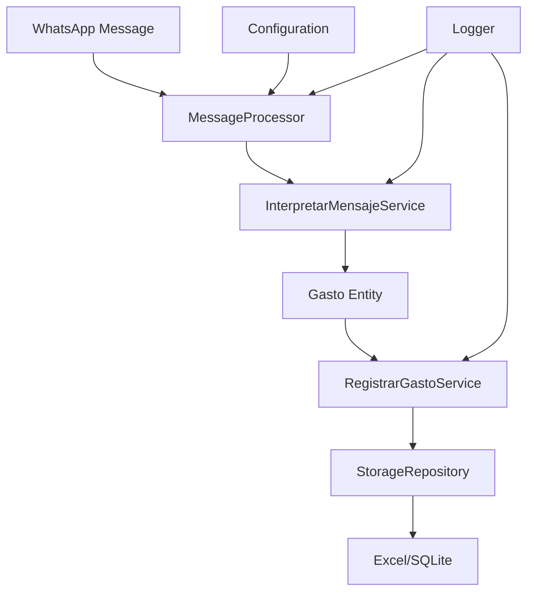

# 👨‍💻 Guía de Desarrollador - Bot Gastos WhatsApp

Esta guía está dirigida a desarrolladores que quieran contribuir, modificar o extender el Bot Gastos WhatsApp.

## 🏗️ Arquitectura del Sistema

### Patrón Clean Architecture

El proyecto sigue los principios de Clean Architecture con separación clara de responsabilidades:

```
┌─────────────────────────────────────────┐
│              Interface Layer             │  ← CLI, GUI, APIs
├─────────────────────────────────────────┤
│             Application Layer            │  ← Use Cases, Services
├─────────────────────────────────────────┤
│              Domain Layer                │  ← Entities, Value Objects
├─────────────────────────────────────────┤
│            Infrastructure Layer          │  ← Storage, WhatsApp, External APIs
└─────────────────────────────────────────┘
```

### Principios de Diseño

1. **Dependency Inversion:** Las capas internas no conocen las externas
2. **Single Responsibility:** Cada clase tiene una sola razón para cambiar
3. **Open/Closed:** Abierto para extensión, cerrado para modificación
4. **Interface Segregation:** Interfaces específicas y cohesivas
5. **Liskov Substitution:** Subtipos sustituibles por sus tipos base

## 📁 Estructura del Proyecto

### Capas y Responsabilidades

```python
bot-gastos/
├── domain/                    # 🧠 Lógica de negocio pura
│   ├── models/
│   │   └── gasto.py          # Entidad principal
│   └── value_objects/
│       ├── monto.py          # Valor monetario
│       └── categoria.py      # Categoría de gasto
├── app/                      # 🔄 Casos de uso
│   ├── services/
│   │   ├── interpretar_mensaje.py  # Parser de mensajes
│   │   └── registrar_gasto.py      # Registro en storage
│   └── usecases/
│       └── procesar_mensaje.py     # Orquestador principal
├── infrastructure/           # 🔌 Implementaciones concretas
│   ├── storage/
│   │   ├── excel_writer.py   # Implementación Excel
│   │   └── sqlite_writer.py  # Implementación SQLite (futuro)
│   └── whatsapp/
│       └── whatsapp_selenium.py    # Integración WhatsApp
├── interface/                # 🖥️ Interfaces externas
│   ├── cli/
│   │   └── run_bot.py        # CLI principal
│   └── gui/                  # GUI futuro
├── shared/                   # 🛠️ Utilidades
│   ├── logger.py            # Sistema logging
│   ├── utils.py             # Funciones auxiliares
│   └── constants.py         # Constantes del sistema
└── config/                   # ⚙️ Configuración
    ├── settings.py          # Gestión configuración
    └── .env.example         # Template variables
```

### Flujo de Datos



## 🔧 Configuración del Entorno de Desarrollo

### Requisitos

- Python 3.9+
- Git
- Chrome/Chromium
- Editor con soporte Python (VS Code recomendado)

### Setup Inicial

```bash
# Clonar repositorio
git clone <repository-url>
cd bot-gastos

# Crear entorno virtual
python -m venv venv

# Activar entorno
# Windows:
venv\Scripts\activate
# Linux/Mac:
source venv/bin/activate

# Instalar dependencias de desarrollo
pip install -r requirements.txt

# Configurar pre-commit hooks (opcional)
pre-commit install
```

### Configuración de Development

```bash
# Copiar configuración de desarrollo
cp config/.env.example config/.env

# Configurar para desarrollo
export DEBUG_MODE=true
export LOG_LEVEL=DEBUG
export CHROME_HEADLESS=false
```

## 🧪 Testing

### Estrategia de Testing

El proyecto implementa testing en pirámide:

```
        E2E Tests
       /        \
  Integration Tests  
     /            \
Unit Tests    Unit Tests
(Domain)      (Services)
```

### Ejecutar Tests

```bash
# Todos los tests
pytest

# Con cobertura
pytest --cov=app --cov=domain --cov=infrastructure

# Tests específicos
pytest tests/domain/test_gasto.py -v

# Tests con output detallado
pytest -s -v

# Tests en modo watch
pytest-watch
```

### Escribir Tests

#### Test de Entidad (Domain)

```python
# tests/domain/test_gasto.py
import pytest
from decimal import Decimal
from datetime import datetime
from domain.models.gasto import Gasto

def test_gasto_creation_valid():
    """Test creación de gasto válido."""
    gasto = Gasto(
        monto=Decimal('100.50'),
        categoria='comida',
        fecha=datetime.now()
    )
    
    assert gasto.monto == Decimal('100.50')
    assert gasto.categoria == 'comida'
    assert isinstance(gasto.fecha, datetime)

def test_gasto_invalid_monto():
    """Test validación de monto inválido."""
    with pytest.raises(ValueError, match="El monto debe ser positivo"):
        Gasto(
            monto=Decimal('-50'),
            categoria='comida', 
            fecha=datetime.now()
        )
```

#### Test de Servicio (Application)

```python
# tests/app/test_interpretar_mensaje.py
import pytest
from app.services.interpretar_mensaje import InterpretarMensajeService

@pytest.fixture
def service():
    return InterpretarMensajeService()

def test_procesar_mensaje_valido(service):
    """Test procesamiento de mensaje válido."""
    gasto = service.procesar_mensaje("gasto: 150 comida")
    
    assert gasto is not None
    assert gasto.monto == Decimal('150')
    assert gasto.categoria == 'comida'

def test_procesar_mensaje_invalido(service):
    """Test mensaje que no contiene gasto."""
    gasto = service.procesar_mensaje("Hola como estas?")
    
    assert gasto is None
```

#### Test de Integración

```python
# tests/integration/test_message_flow.py
import pytest
from app.usecases.procesar_mensaje import ProcesarMensajeUseCase
from infrastructure.storage.excel_writer import ExcelStorage

@pytest.fixture
def temp_excel_storage(tmp_path):
    """Fixture para storage temporal."""
    excel_file = tmp_path / "test_gastos.xlsx"
    return ExcelStorage(str(excel_file))

def test_flujo_completo_mensaje(temp_excel_storage):
    """Test del flujo completo desde mensaje hasta storage."""
    # Arrange
    use_case = ProcesarMensajeUseCase(temp_excel_storage)
    mensaje = "gasto: 200 transporte"
    
    # Act
    resultado = use_case.procesar(mensaje)
    
    # Assert
    assert resultado is not None
    assert resultado.monto == Decimal('200')
    assert resultado.categoria == 'transporte'
    
    # Verificar que se guardó en storage
    gastos = temp_excel_storage.obtener_gastos(
        fecha_desde=date.today(),
        fecha_hasta=date.today()
    )
    assert len(gastos) == 1
    assert gastos[0].monto == Decimal('200')
```

## 🔌 Extensibilidad

### Agregar Nuevo Storage

1. **Crear implementación** en `infrastructure/storage/`:

```python
# infrastructure/storage/postgresql_writer.py
from typing import List
from datetime import date
from domain.models.gasto import Gasto
from app.services.registrar_gasto import StorageRepository

class PostgreSQLStorage(StorageRepository):
    def __init__(self, connection_string: str):
        self.connection_string = connection_string
        # Setup connection...
    
    def guardar_gasto(self, gasto: Gasto) -> bool:
        # Implementation...
        pass
    
    def obtener_gastos(self, fecha_desde: date, fecha_hasta: date) -> List[Gasto]:
        # Implementation...
        pass
```

2. **Agregar a configuración:**

```python
# config/settings.py
class StorageMode(Enum):
    EXCEL = "excel"
    SQLITE = "sqlite"
    POSTGRESQL = "postgresql"  # ← Nueva opción
```

3. **Integrar en factory:**

```python
# main.py o factory
def create_storage(settings: Settings):
    if settings.storage_mode == StorageMode.POSTGRESQL:
        return PostgreSQLStorage(settings.postgresql.connection_string)
    # ... other storages
```

### Agregar Nueva Fuente de Mensajes

1. **Definir interfaz:**

```python
# app/services/message_source.py
from typing import Protocol, List, Tuple
from datetime import datetime

class MessageSource(Protocol):
    def connect(self) -> bool: ...
    def get_new_messages(self) -> List[Tuple[str, datetime]]: ...
    def disconnect(self) -> None: ...
```

2. **Implementar connector:**

```python
# infrastructure/telegram/telegram_connector.py
class TelegramConnector:
    def connect(self) -> bool:
        # Implement Telegram Bot API connection
        pass
    
    def get_new_messages(self) -> List[Tuple[str, datetime]]:
        # Get messages from Telegram
        pass
```

### Agregar Nuevas Categorías Dinámicamente

```python
# domain/value_objects/categoria.py
@classmethod
def agregar_categoria_valida(cls, nueva_categoria: str) -> None:
    """Agrega nueva categoría en runtime."""
    categoria_normalizada = nueva_categoria.lower().strip()
    cls.CATEGORIAS_VALIDAS.add(categoria_normalizada)

# Uso:
Categoria.agregar_categoria_valida("streaming")
```

## 🎨 Patrones de Diseño Utilizados

### 1. Repository Pattern

```python
# Abstract repository
class StorageRepository(Protocol):
    def guardar_gasto(self, gasto: Gasto) -> bool: ...
    def obtener_gastos(self, fecha_desde: date, fecha_hasta: date) -> List[Gasto]: ...

# Concrete implementations
class ExcelStorage(StorageRepository): ...
class SQLiteStorage(StorageRepository): ...
```

### 2. Strategy Pattern

```python
# Para diferentes parsers de mensaje
class MessageParser(Protocol):
    def parse(self, message: str) -> Optional[Gasto]: ...

class SpanishMessageParser(MessageParser): ...
class EnglishMessageParser(MessageParser): ...
```

### 3. Factory Pattern

```python
def create_storage_repository(settings: Settings) -> StorageRepository:
    if settings.storage_mode == StorageMode.EXCEL:
        return ExcelStorage(settings.excel.excel_file_path)
    elif settings.storage_mode == StorageMode.SQLITE:
        return SQLiteStorage(settings.database.sqlite_file_path)
    else:
        raise ValueError(f"Storage mode not supported: {settings.storage_mode}")
```

### 4. Observer Pattern

```python
# Para eventos del sistema
class EventPublisher:
    def __init__(self):
        self.subscribers = []
    
    def subscribe(self, callback):
        self.subscribers.append(callback)
    
    def publish(self, event):
        for callback in self.subscribers:
            callback(event)

# Uso:
publisher.subscribe(lambda event: logger.info(f"Gasto registrado: {event}"))
```

## 🚀 Deployment y CI/CD

### Build Local

```bash
# Instalar dependencias
pip install -r requirements.txt

# Ejecutar linting
flake8 app/ domain/ infrastructure/ interface/

# Ejecutar type checking
mypy app/ domain/ infrastructure/ interface/

# Ejecutar tests
pytest --cov=app --cov=domain --cov=infrastructure

# Build distribución
python setup.py sdist bdist_wheel
```

### Docker (Futuro)

```dockerfile
FROM python:3.9-slim

WORKDIR /app
COPY requirements.txt .
RUN pip install -r requirements.txt

COPY . .
CMD ["python", "main.py"]
```

## 🐛 Debugging

### Logging Levels

```python
# Configurar nivel detallado
export LOG_LEVEL=DEBUG

# En código:
logger.debug("Mensaje detallado para desarrollo")
logger.info("Información general")
logger.warning("Advertencia")
logger.error("Error recoverable")
logger.critical("Error crítico")
```

### Debugging con IDE

**VS Code launch.json:**

```json
{
    "version": "0.2.0",
    "configurations": [
        {
            "name": "Bot Gastos Debug",
            "type": "python",
            "request": "launch",
            "program": "${workspaceFolder}/main.py",
            "args": ["--mode", "dev"],
            "console": "integratedTerminal",
            "env": {
                "DEBUG_MODE": "true",
                "LOG_LEVEL": "DEBUG"
            }
        }
    ]
}
```

### Profiling Performance

```python
# Usar el decorador timing
@timing_decorator
def proceso_lento():
    # código a medir
    pass

# O manualmente:
import time
start = time.time()
# ... código ...
logger.info(f"Operación tomó {time.time() - start:.2f}s")
```

## 🔒 Seguridad

### Principios

1. **No hardcodear credenciales** - Usar variables de entorno
2. **Validar toda entrada** - Sanitizar mensajes de usuario
3. **Logs sin información sensible** - No loggear credenciales
4. **Permisos mínimos** - Archivos con permisos restrictivos

### Implementación

```python
# Validación de entrada
def validate_message(message: str) -> bool:
    # Verificar longitud
    if len(message) > MAX_MESSAGE_LENGTH:
        return False
    
    # Verificar caracteres peligrosos
    dangerous_chars = ['<', '>', '&', '"', "'"]
    if any(char in message for char in dangerous_chars):
        return False
    
    return True

# Sanitización
def sanitize_category(category: str) -> str:
    # Solo permitir caracteres alfanuméricos
    return re.sub(r'[^a-zA-Z0-9]', '', category).lower()
```

## 📊 Monitoreo y Métricas

### Métricas Clave

```python
class BotMetrics:
    def __init__(self):
        self.mensajes_procesados = 0
        self.gastos_registrados = 0
        self.errores = 0
        self.tiempo_promedio_procesamiento = 0.0
    
    def incrementar_mensaje_procesado(self):
        self.mensajes_procesados += 1
    
    def registrar_tiempo_procesamiento(self, tiempo: float):
        # Calcular promedio móvil
        self.tiempo_promedio_procesamiento = (
            self.tiempo_promedio_procesamiento * 0.9 + tiempo * 0.1
        )
```

### Health Checks

```python
def health_check() -> Dict[str, bool]:
    """Verifica la salud del sistema."""
    return {
        'storage_accessible': test_storage_access(),
        'whatsapp_connected': test_whatsapp_connection(),
        'logs_writable': test_log_writing(),
        'config_valid': validate_configuration()
    }
```

## 🤝 Contribuir

### Flujo de Contribución

1. **Fork** el repositorio
2. **Crear branch** para tu feature: `git checkout -b feature/nueva-funcionalidad`
3. **Escribir tests** para el nuevo código
4. **Implementar** la funcionalidad
5. **Ejecutar tests** y linting: `pytest && flake8`
6. **Commit** con mensaje descriptivo
7. **Push** a tu fork: `git push origin feature/nueva-funcionalidad`
8. **Crear Pull Request** con descripción detallada

### Estándares de Código

```python
# Usar type hints
def procesar_mensaje(mensaje: str, fecha: Optional[datetime] = None) -> Optional[Gasto]:
    pass

# Docstrings estilo Google
def funcion_ejemplo(param1: str, param2: int) -> bool:
    """
    Descripción breve de la función.
    
    Args:
        param1: Descripción del parámetro 1
        param2: Descripción del parámetro 2
        
    Returns:
        True si exitoso, False si no
        
    Raises:
        ValueError: Si param1 está vacío
    """
    pass

# Naming conventions
class MiClase:          # PascalCase para clases
    def mi_metodo(self):   # snake_case para métodos y variables
        MI_CONSTANTE = 10  # UPPER_CASE para constantes
```

### Code Review Checklist

- [ ] Tests incluidos y pasando
- [ ] Documentación actualizada
- [ ] Type hints agregados
- [ ] Logging apropiado
- [ ] Error handling robusto
- [ ] Performance considerada
- [ ] Seguridad revisada
- [ ] Backward compatibility mantenida

## 📚 Recursos Adicionales

- **Clean Architecture:** [Uncle Bob's Blog](https://blog.cleancoder.com/uncle-bob/2012/08/13/the-clean-architecture.html)
- **Python Type Hints:** [mypy documentation](http://mypy-lang.org/)
- **Testing:** [pytest documentation](https://docs.pytest.org/)
- **Selenium:** [selenium-python docs](https://selenium-python.readthedocs.io/)
- **Domain-Driven Design:** [DDD Reference](https://www.domainlanguage.com/ddd/reference/)